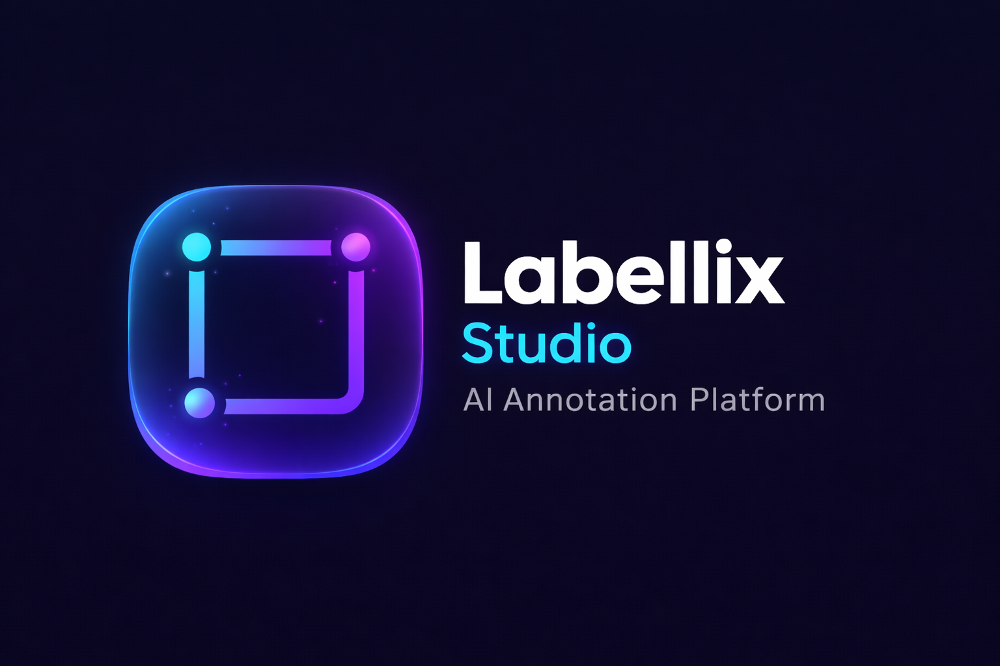
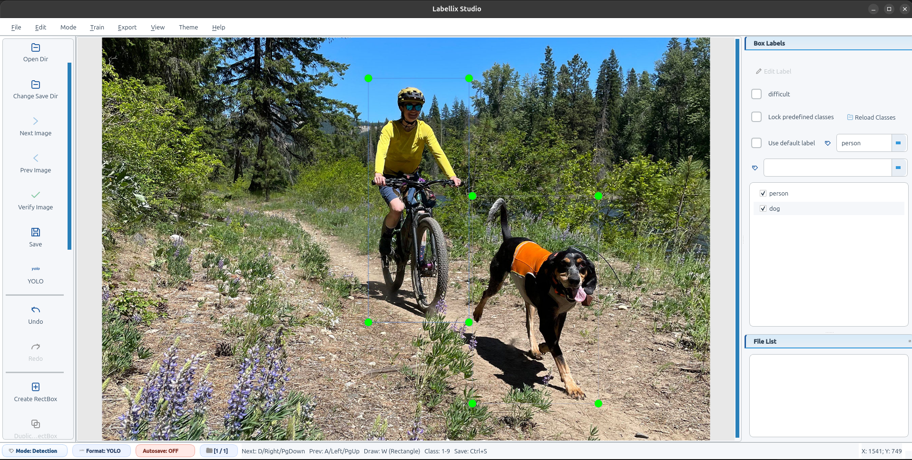
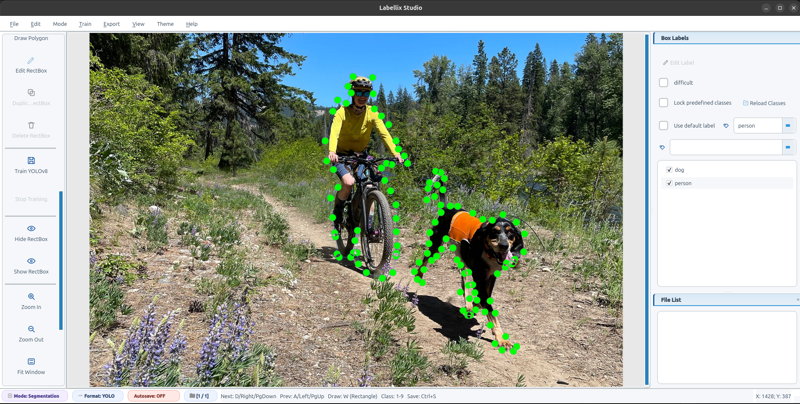

<p align="center">
   
</p>

<p align="center">
   
</p>

# Labellix Studio


**Labellix Studio** is a production-ready desktop annotation suite built with **Python + PyQt5** for high-quality dataset creation workflows.

It supports end-to-end pipelines for:

1. Object Detection (bounding boxes)
2. Segmentation (polygon annotations)
3. Image Classification (single-label tagging)
4. License Plate Labeling (plate text + bounding box)
5. Dataset Export for YOLO, Classification, and License Plate formats
6. In-app YOLO training workflow integration

Get started in 5 minutes with the Quick Start section.

## 📑 Table of Contents

- [✨ Features](#features)
- [🖼️ Visual Overview](#visual-overview)
- [🧩 Mode Icon Map](#mode-icon-map)
- [🚀 Quick Start](#quick-start)
- [🔧 Installation and Setup](#installation-and-setup)
- [🏷️ Annotation Modes](#annotation-modes)
- [🖥️ Training Mode](#training-mode)
- [📦 Dataset Export Workflows](#dataset-export-workflows)
- [⌨️ Keyboard Shortcuts](#keyboard-shortcuts)
- [⚙️ Configuration](#configuration)
- [🏗️ Architecture Overview](#architecture-overview)
- [🛠️ Core Module Details](#core-module-details)
- [💾 Project Folder Structure](#project-folder-structure)
- [🧪 Testing](#testing)
- [🐛 Troubleshooting](#troubleshooting)
- [⚡ Performance Tips](#performance-tips)
- [🔒 Data Safety Notes](#data-safety-notes)
- [📄 License](#license)
- [🤝 Contributing](#contributing)
- [📞 Support](#support)

## ✨ Features

1. 🎯 Multi-mode annotation in a single desktop UI: detection, segmentation, classification, license plate, and training.
2. 🧾 Annotation storage support: Pascal VOC XML, YOLO TXT, CreateML JSON.
3. 📦 YOLO dataset export with split ratio validation, random seed, preview, optional stratified split, stats, and YAML output.
4. 🗂️ Classification export with class-wise folder output, copy/move controls, and optional ZIP generation.
5. 🚗 License plate export with two modes:

- Full image + labels
- Cropped plate-only output

6. ⚡ Productivity features: class shortcuts (1-9), undo/redo history, image verification, and auto-next workflows.
7. 🛡️ Validation-first IO and export guards to reduce broken dataset outputs.

## 🖼️ Visual Overview

### 🎯 Detection Workflow Snapshot



Detection view is optimized for fast rectangle drawing, quick class selection,
and immediate save/verify loops.

### ✂️ Segmentation Workflow Snapshot



Segmentation view focuses on contour precision, polygon point editing, and
high-fidelity boundary annotation.

## 🧩 Mode Icon Map

| Mode | Icon | Primary Purpose |
|---|---|---|
| Detection |  | Bounding-box annotation for detector training |
| Segmentation |  | Polygon contour annotation |
| Classification |  | One-label-per-image tagging |
| License Plate |  | Plate text + bounding box capture |
| Training |  | Launch and monitor YOLO training |

## 🚀 Quick Start

```bash
# 1) Clone and enter project
git clone https://github.com/VijayRajput4455/Labellix-Studio.git
cd Labellix-Studio

# 2) Create conda environment
conda env create -f environment.yml
conda activate labellix-studio

# 3) Launch app
python3 labellix_studio.py
```

Optional startup arguments:

```bash
python3 labellix_studio.py [IMAGE_PATH] [PREDEFINED_CLASSES_FILE]
```

## 🔧 Installation and Setup

### System Requirements

| Requirement | Version | Notes |
|---|---|---|
| Python | 3.8+ | Recommended via conda environment |
| UI Framework | PyQt5 | Required for desktop UI |
| OS | Linux, macOS, Windows | Linux may need xcb plugin setup |

### 1️⃣ Step 1: Clone repository

```bash
git clone https://github.com/VijayRajput4455/Labellix-Studio.git
cd Labellix-Studio
```

### 2️⃣ Step 2: Conda setup (recommended)

```bash
conda env create -f environment.yml
conda activate labellix-studio
```

If the environment already exists:

```bash
conda env update -f environment.yml --prune
conda activate labellix-studio
```

Alternative bootstrap script:

```bash
chmod +x scripts/setup_conda.sh
./scripts/setup_conda.sh
conda activate labellix-studio
```

### 3️⃣ Step 3: pip + venv setup (alternative)

```bash
python3 -m venv .venv
source .venv/bin/activate
pip install --upgrade pip
pip install -r requirements/requirements.txt
```

### 4️⃣ Step 4: Run the app

```bash
python3 labellix_studio.py
```

## 🏷️ Annotation Modes

###  Object Detection Mode

🎯 Goal:
Create rectangular bounding boxes and class labels for detection datasets.

✅ Best for:

1. Multi-object scenes with variable scale.
2. Detector training data for YOLO-like pipelines.
3. Fast iterative annotation on large image batches.

🧭 How it works (detailed flow):

1. Open an image directory.
2. Select object class from predefined classes list.
3. Draw rectangle boxes with mouse-driven corner placement.
4. Refine box position and dimensions for tight object fit.
5. Assign and verify class label for each box.
6. Save annotation for current image.
7. Use navigation shortcuts to move rapidly through image set.
8. Run export workflow for YOLO / Pascal VOC / CreateML.

📋 Detection quality checklist:

1. Ensure each target object has exactly one correct box.
2. Avoid over-large boxes that include excessive background.
3. Keep partially visible objects labeled if they are training-relevant.
4. Maintain class consistency for visually similar categories.
5. Verify no unlabeled images before export.

⚠️ Common mistakes to avoid:

1. Using wrong class due to fast-click labeling.
2. Drawing boxes from object center rather than edge-to-edge fit.
3. Missing small/occluded objects in crowded scenes.
4. Class-file mismatch between annotation and export session.

📤 Detection outputs:

1. Pascal VOC XML
2. YOLO TXT + classes.txt
3. CreateML JSON

🖼️ Detection visualization:


###  Image Classification Mode

🎯 Goal:
Assign one class label per image and export class-wise datasets.

✅ Best for:

1. Single-label classification datasets.
2. Fast image triage and category routing.
3. Building baseline classifiers quickly.

🧭 How it works (detailed flow):

1. Switch to Classification Mode.
2. Manage classes (add/rename/remove).
3. Assign one and only one class label per image.
4. Review unlabeled image count before export.
5. State is tracked in `.labellix_classification.json`.
6. Export to class-wise directories with copy/move option.
7. Optionally generate a ZIP archive for handoff.

📋 Classification quality checklist:

1. Keep class names stable once labeling starts.
2. Balance class distribution where possible.
3. Resolve ambiguous images with clear project rules.
4. Confirm zero unlabeled images before export.

⚠️ Common mistakes to avoid:

1. Mid-project class rename without migration.
2. Exporting before all images are assigned.
3. Mixing train/validation semantics in class names.

###  Segmentation Mode (Polygon Labeling)

🎯 Goal:
Annotate irregular object boundaries using polygons.

✅ Best for:

1. Contour-aware model training.
2. Fine-grained boundary supervision.
3. Scenarios where boxes are too coarse.

🧭 How it works (detailed flow):

1. Switch to Segmentation Mode.
2. Draw polygon points around each object contour.
3. Add points densely in high-curvature regions.
4. Finalize polygon with Enter or double click.
5. Edit/reposition points when edges are imprecise.
6. Assign class label to each finalized polygon.
7. Save segmentation metadata and validate output.

📋 Segmentation quality checklist:

1. Keep polygon edges aligned to true object boundary.
2. Add enough points for curvature but avoid noisy over-pointing.
3. Ensure polygon closure and correct object assignment.
4. Validate segmentation shapes before export.

🧠 Implementation notes:

1. Segmentation shapes are tracked with an `is_segment` flag.
2. Polygon point sets are persisted in Pascal VOC XML segmentation nodes.
3. Detection and segmentation can coexist in the same workflow.

🖼️ Segmentation visualization:


###  License Plate Labeling Mode

🎯 Goal:
Capture plate text and bounding box coordinates in strict TXT rows.

✅ Best for:

1. ANPR and plate-reading datasets.
2. Combined OCR + localization pipelines.
3. Region-specific plate pattern studies.

🧾 Input/output row format:

```text
plate_text xmin ymin xmax ymax
```

🧪 Example:

```text
MH12AB1234 120 210 310 278
```

🧭 How it works (detailed flow):

1. Switch to License Plate Mode.
2. Draw bounding boxes around plates.
3. Enter plate text exactly as visible.
4. Save TXT annotations per image.
5. Validate numeric coordinates and row structure.
6. Export full-image labels or cropped-plate dataset.

🛡️ Safety protections:

1. Parser validates numeric coordinates.
2. Prevents accidental YOLO-TXT interpretation in plate mode.
3. Supports tab-separated and whitespace-separated rows.

📋 License plate quality checklist:

1. Keep text transcription faithful to image (no guesswork).
2. Include difficult cases: blur, angle, partial occlusion.
3. Maintain tight boxes around plate boundaries.
4. Verify character case and spacing policy consistency.

##  🖥️ Training Mode

Labellix Studio includes a training workflow panel for YOLO runs from UI.

✅ Best for:

1. Quick experiment cycles from freshly exported datasets.
2. Non-terminal users who prefer in-app control.
3. Traceable runs with live logs.

🧭 What it covers (detailed flow):

1. Source selection from previous exports or dataset YAML
2. Run naming and model-size presets
3. Real-time log streaming
4. Stop/restart-friendly training worker handling
5. Repeatable run management for iterative tuning

📋 Training quality checklist:

1. Confirm dataset split validity before launching.
2. Verify class mapping matches training config.
3. Watch logs for early data/path errors.
4. Keep run names descriptive for reproducibility.

## 📦 Dataset Export Workflows

### 📦 YOLO Dataset Export (Detection/Segmentation)

⚙️ Configuration options:

1. Export folder and dataset name
2. Train/Test/Valid split ratios (must sum to 100)
3. Shuffle + random seed
4. Optional stratified split by dominant class
5. Optional split preview
6. Optional ZIP generation

🛡️ Quality checks included:

1. Missing/unlabeled image guard
2. Empty label file detection
3. Invalid class index detection against classes.txt
4. Duplicate image-group discovery

🗂️ Output structure:

```text
yolo_dataset/
  dataset.yaml
  dataset_stats.json
  train/
    images/
    labels/
  test/
    images/
    labels/
  valid/
    images/
    labels/
```

### 🏷️ Classification Dataset Export

🗂️ Output structure:

```text
classification_dataset/
  class_1/
  class_2/
  class_3/
```

### 🚗 License Plate Dataset Export

🗂️ Output structure:

```text
license_plate_dataset/
  images/
  labels/
  export_report.json
```

## ⌨️ Keyboard Shortcuts

🧭 Navigation:

1. Next Image: D / Right / PgDown
2. Previous Image: A / Left / PgUp

✍️ Annotation:

1. Draw Box: W
2. Toggle Draw Square: Ctrl+Shift+R
3. Quick Class Select: 1-9
4. Finalize Polygon: Enter or Double Click
5. Verify Image: Space

🔀 Mode switching:

1. Detection Mode: Ctrl+Shift+D
2. Classification Mode: Ctrl+Shift+C
3. License Plate Mode: Ctrl+Shift+N
4. Segmentation Mode: Ctrl+Shift+G
5. Training Mode: Ctrl+Shift+K

📁 File and view:

1. Open File: Ctrl+O
2. Open Folder: Ctrl+U
3. Save: Ctrl+S
4. Delete Current Image: Ctrl+Shift+X
5. Compact Mode: Ctrl+Shift+M
6. Focus Mode: F11
7. Shortcuts Help: ?

## ⚙️ Configuration

🧾 Predefined class files by mode:

1. `data/predefined_classes.txt`
2. `data/predefined_classes_classification.txt`
3. `data/predefined_classes_license_plate.txt`

🧩 Related workflow modules:

1. Training: `libs/training_workflows.py`, `libs/training_runner.py`
2. Export: `libs/export_workflows.py`, `libs/yolo_io.py`, `libs/classification_io.py`, `libs/license_plate_io.py`

## 🏗️ Architecture Overview

🧭 Workflow pipeline:

```text
Open Images/Folder
   -> Select Mode (Detection/Segmentation/Classification/License Plate/Training)
   -> Annotate + Validate
   -> Save Mode-Specific Labels
   -> Run Export Workflow
   -> Generate Dataset + Stats/Reports
   -> (Optional) Launch Training
```

🧠 Design notes:

1. Mode transitions are controlled through `mode_controller`.
2. Canvas supports both rectangle and polygon workflows.
3. IO adapters and validators reduce malformed outputs.
4. Export pipelines run consistency checks before writes.

## 🛠️ Core Module Details

1. `labellix_studio.py`:
   Main application window, actions, dialogs, and mode wiring.
2. `libs/canvas.py`:
   Drawing engine for boxes and polygons.
3. `libs/mode_controller.py`:
   Safe mode transitions and mode-specific action routing.
4. `libs/annotation_workflows.py`:
   Save/load orchestration for all annotation formats.
5. `libs/yolo_io.py`:
   YOLO read/write and dataset export session logic.
6. `libs/classification_io.py`:
   Manifest-backed classification state and export.
7. `libs/license_plate_io.py`:
   Plate TXT parsing, validation, and export logic.
8. `libs/export_workflows.py`:
   User-facing export dialog workflows.
9. `libs/training_workflows.py` + `libs/training_runner.py`:
   In-app training configuration and execution.

## 💾 Project Folder Structure

```text
Labellix-Studio/
|-- labellix_studio.py
|-- environment.yml
|-- README.rst
|-- README.md
|-- data/
|   |-- predefined_classes.txt
|   |-- predefined_classes_classification.txt
|   `-- predefined_classes_license_plate.txt
|-- libs/
|   |-- canvas.py
|   |-- mode_controller.py
|   |-- annotation_workflows.py
|   |-- export_workflows.py
|   |-- yolo_io.py
|   |-- classification_io.py
|   |-- license_plate_io.py
|   `-- ...
|-- resources/
|   |-- desktop_icon.png
|   |-- icons/
|   `-- strings/
|-- requirements/
|   |-- requirements.txt
|   `-- requirements-linux-python3.txt
|-- scripts/
|   `-- setup_conda.sh
`-- tests/
    |-- test_io.py
    |-- test_classification_service.py
    |-- test_license_plate_io.py
    `-- ...
```

## 🧪 Testing

✅ Run selected tests:

```bash
python -m unittest tests.test_io -q
python -m unittest tests.test_settings -q
python -m unittest tests.test_classification_service -q
python -m unittest tests.test_license_plate_io -q
```

🧪 Run full test suite:

```bash
python -m unittest discover -s tests -p "test_*.py"
```

## 🐛 Troubleshooting

1. ❌ ModuleNotFoundError for PyQt5:
   Install dependencies from requirements and confirm active environment.
2. ❌ YOLO export class consistency issues:
   Verify `classes.txt` and label index ranges.
3. ❌ License plate TXT load issues:
   Ensure rows follow: `plate_text xmin ymin xmax ymax`.
4. ❌ Qt plugin/xcb startup issue on Linux:
   Run with `QT_QPA_PLATFORM=xcb python3 labellix_studio.py`.
5. ❌ Settings/state feels stale:
   Use reset options and restart the app.

## ⚡ Performance Tips

1. ⚡ Use shortcut keys heavily (`1-9`, `W`, `D`, `A`) to increase annotation speed.
2. 🧾 Keep class files mode-specific to reduce label mismatch risk.
3. 👀 Use split preview before large exports.
4. 🎯 Set random seed and stratified split for reproducible training data.
5. ✅ Run full tests before release packaging.

## 🔒 Data Safety Notes

1. 🛡️ Validate annotations before export to avoid corrupt training datasets.
2. 🗂️ Version source annotations and exported datasets.
3. 🔐 Treat personal and license plate data as sensitive.
4. 🚫 Restrict access to datasets in production environments.

## 📄 License

MIT License.

## 🤝 Contributing

✨ Contributions are welcome. Please open an issue first for major changes and include tests for workflow-critical updates.

## 📞 Support

💬 For issues, feature requests, or workflow help, open a GitHub issue in this repository.
