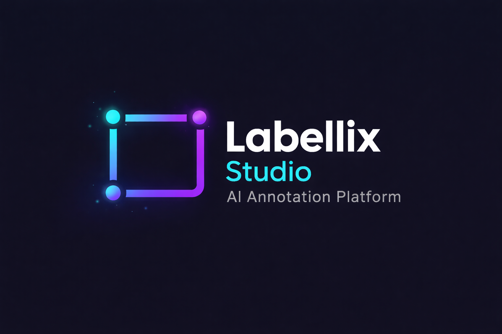

Labellix Studio v3.0 (Enhanced)
===============================

Labellix Studio is a desktop image annotation application built with Python and PyQt5.
This fork keeps the original labeling workflow and adds stronger quality checks,
better annotation productivity, and one-click YOLO dataset export.

What This Project Does
----------------------

1. Draw and edit bounding boxes on images.
2. Save annotations in PascalVOC, YOLO, and CreateML formats.
3. Run in object detection mode or image classification mode.
4. Export complete, split YOLO training datasets (train/test/valid).
5. Track annotation history with undo/redo.
6. Resume the previous labeling session automatically.

Main Features
-------------

Annotation and Editing
~~~~~~~~~~~~~~~~~~~~~~

1. Rectangle drawing and editing.
2. Label assignment and relabeling.
3. Duplicate selected box.
4. Hide/show all boxes.
5. Per-shape color customization.
6. Image verification flag support.

Productivity
~~~~~~~~~~~~

1. Undo/redo annotation changes.
2. Numeric class shortcuts (keys 1-9).
3. Auto next image on save (optional toggle).
4. Next unlabeled image navigation.
5. Session resume for last file, index, and zoom.

Safety and Robustness
~~~~~~~~~~~~~~~~~~~~~

1. Safer image deletion using internal trash folder.
2. Reduced broad exception handling in parsers and settings logic.
3. Translation fallback to avoid hard crash when a key is missing.

YOLO Dataset Export (Enhanced)
~~~~~~~~~~~~~~~~~~~~~~~~~~~~~~

1. Export from app menu: File/Export or Export menu.
2. Split dataset into train/test/valid with custom ratios.
3. Optional split preview before writing files.
4. Optional stratified split by dominant class.
5. Configurable random seed for reproducible split.
6. Missing-label guard and warning before export.
7. Class consistency check against classes.txt indices.
8. Duplicate image group detection shown in preview/report.
9. Output files:
   - ``dataset.yaml``
   - ``dataset_stats.json``
10. Optional one-click zip archive generation after export.

Supported Annotation Formats
----------------------------

1. PascalVOC (XML)
2. YOLO (TXT + classes.txt)
3. CreateML (JSON)

System Requirements
-------------------

1. Python 3.8+ recommended.
2. PyQt5
3. lxml

Installation
------------

Quick environment setup on Linux:

.. code:: bash

    python3 -m venv .venv
    source .venv/bin/activate
    pip install --upgrade pip
    pip install -r requirements/requirements.txt

Conda environment setup (recommended for sharing with team):

.. code:: bash

    conda env create -f environment.yml
    conda activate labellix-studio

One-command setup script:

.. code:: bash

    chmod +x scripts/setup_conda.sh
    ./scripts/setup_conda.sh
    conda activate labellix-studio

If the environment already exists:

.. code:: bash

    conda env update -f environment.yml --prune
    conda activate labellix-studio

Run the app:

.. code:: bash

    python3 labellix_studio.py

Optional startup arguments:

.. code:: bash

    python3 labellix_studio.py [IMAGE_PATH] [PREDEFINED_CLASSES_FILE]

Quick Start in 60 Seconds
-------------------------

From a fresh clone, run these commands in order:

.. code:: bash

    python3 -m venv .venv
    source .venv/bin/activate
    pip install -r requirements/requirements.txt
    python3 labellix_studio.py

Environment Info (for easy support/debugging)
----------------------------------------------

Collect and share active environment details:

.. code:: bash

    python --version
    pip --version
    pip freeze

Export reproducible conda environment files:

.. code:: bash

    conda env export --name labellix-studio > environment.lock.yml
    conda env export --from-history --name labellix-studio > environment.history.yml

If your Linux desktop has Qt display plugin issues, try:

.. code:: bash

    QT_QPA_PLATFORM=xcb python3 labellix_studio.py

First-time in-app setup checklist:

1. Open Dir and select your image folder.
2. Load or edit classes in ``data/predefined_classes.txt``.
3. Select save format (PascalVOC, YOLO, or CreateML).
4. Draw the first box, assign label, and press save.
5. Enable Auto Next on Save if you want faster sequential labeling.

Basic Workflow
--------------

Object Detection
~~~~~~~~~~~~~~~~

1. Open an image directory.
2. Create/edit bounding boxes.
3. Assign labels from class list.
4. Save annotations.
5. Use next/previous navigation and continue.

Image Classification Mode
~~~~~~~~~~~~~~~~~~~~~~~~~

1. Switch to Classification Mode.
2. Assign one class per image.
3. Export grouped dataset by class folders.

YOLO Export Workflow
--------------------

1. Prepare labels and ensure ``classes.txt`` is valid.
2. Open Export YOLO Dataset.
3. Enter dataset folder name.
4. Enter train/test/valid ratios (sum must be 100).
5. Choose random seed.
6. Optionally enable preview and stratified split.
7. Confirm export.
8. Optionally create zip archive.

Export Folder Layout
~~~~~~~~~~~~~~~~~~~~

.. code:: text

    dataset_name/
      dataset.yaml
      dataset_stats.json
      train/
        images/
        labels/
      test/
        images/
        labels/
      valid/
        images/
        labels/

Keyboard Shortcuts
------------------

+--------------------+--------------------------------------------+
| Ctrl + U           | Open image directory                        |
+--------------------+--------------------------------------------+
| Ctrl + R           | Change default save directory               |
+--------------------+--------------------------------------------+
| Ctrl + S           | Save annotation                             |
+--------------------+--------------------------------------------+
| Ctrl + D           | Duplicate selected box                      |
+--------------------+--------------------------------------------+
| Ctrl + Shift + D   | Delete current image (safe-trash flow)      |
+--------------------+--------------------------------------------+
| Ctrl + Z           | Undo annotation change                       |
+--------------------+--------------------------------------------+
| Ctrl + Shift + Z   | Redo annotation change                       |
+--------------------+--------------------------------------------+
| W                  | Create rectangle box                         |
+--------------------+--------------------------------------------+
| A                  | Previous image                               |
+--------------------+--------------------------------------------+
| D                  | Next image                                   |
+--------------------+--------------------------------------------+
| Del                | Delete selected box                          |
+--------------------+--------------------------------------------+
| 1..9               | Quick-assign class index                     |
+--------------------+--------------------------------------------+
| Space              | Toggle image verified                        |
+--------------------+--------------------------------------------+
| Arrow keys         | Move selected box                            |
+--------------------+--------------------------------------------+
| Ctrl + + / Ctrl + -| Zoom in / Zoom out                           |
+--------------------+--------------------------------------------+

Settings and Session State
--------------------------

The app stores preferences (last file, window state, autosave, mode options,
resume index, resume zoom, export paths) in the local settings file. If needed,
you can reset settings from File/Reset All.

Project Structure
-----------------

1. ``labellix_studio.py``: branded launcher entrypoint.
2. ``libs/``: core modules (canvas, parsers, settings, YOLO IO, utilities).
3. ``resources/``: icons and localized strings.
4. ``data/predefined_classes.txt``: default label class list.
5. ``tests/``: unit tests for IO/settings/utils.

Runtime-Only Repository Policy
------------------------------

This repository is intentionally cleaned for runtime-focused usage.
Keep only files needed to run, maintain, and test the application.

Keep these top-level paths:

1. ``labellix_studio.py``
2. ``libs/``
3. ``resources/``
4. ``data/``
5. ``requirements/``
6. ``tests/``
7. ``README.rst``
8. ``LICENSE``

Do not re-add legacy packaging/CI/demo folders unless there is a specific,
active need and a maintainer decision.

Legacy Cleanup Log
------------------

The following legacy or non-runtime items were removed during cleanup:

1. Packaging/build metadata: ``setup.py``, ``setup.cfg``, ``MANIFEST.in``, ``Makefile``.
2. Repository workflow/docs extras: ``.github/``, ``CONTRIBUTING.rst``, ``HISTORY.rst``, ``issue_template.md``.
3. Legacy helper/demo trees: ``build-tools/``, ``demo/``, ``tools/``, ``readme/``.
4. Redundant/unreferenced files: ``styletheame_old.py``, root ``computer.png``, ``Pasted image.png``.

Run Tests
---------

.. code:: bash

    python -m unittest tests.test_io -q
    python -m unittest tests.test_settings -q

Troubleshooting
---------------

Common Errors and One-Line Fixes
~~~~~~~~~~~~~~~~~~~~~~~~~~~~~~~~

+--------------------------------------+--------------------------------------------------------------+
| Symptom                              | One-line fix                                                 |
+--------------------------------------+--------------------------------------------------------------+
| ``ModuleNotFoundError: PyQt5``       | ``pip install -r requirements/requirements.txt`` |
+--------------------------------------+--------------------------------------------------------------+
| ``ModuleNotFoundError: lxml``        | ``pip install lxml``                                         |
+--------------------------------------+--------------------------------------------------------------+
| Qt platform plugin / xcb issue       | ``QT_QPA_PLATFORM=xcb python3 labellix_studio.py``         |
+--------------------------------------+--------------------------------------------------------------+
| Classes are empty or missing         | Fill ``data/predefined_classes.txt`` and restart app         |
+--------------------------------------+--------------------------------------------------------------+
| YOLO export class index mismatch     | Ensure every label index is in range of ``classes.txt``      |
+--------------------------------------+--------------------------------------------------------------+
| Settings feel broken or stale        | Use File/Reset All, then restart                             |
+--------------------------------------+--------------------------------------------------------------+

1. If GUI does not start, verify PyQt5 is installed in the active environment.
2. If classes are missing, check ``data/predefined_classes.txt`` or your custom class file.
3. If export fails class checks, verify YOLO label indices match ``classes.txt``.
4. If behavior is inconsistent, use File/Reset All and restart.

License
-------

MIT License. See ``LICENSE``.

